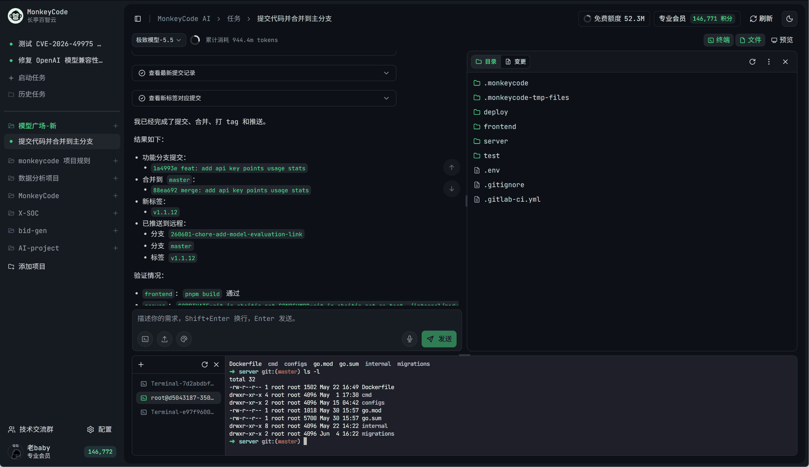

# DevLoom

<p align="center">
  
</p>

<p align="center">
  <a href="https://github.com/Y-vQv-Y/DevLoom/actions/workflows/build.yml"></a>
  <a href="https://github.com/Y-vQv-Y/DevLoom/actions/workflows/electron-release.yml"></a>
  <a href="./LICENSE"></a>
</p>

<p align="center">
  <a href="https://github.com/Y-vQv-Y/DevLoom">Project Home</a> ·
  <a href="#self-hosted-deployment">Self-Hosted Deployment</a> ·
  <a href="./docs/DEPLOYMENT_CN.md">Deployment Guide</a> ·
  <a href="./docs/USER_GUIDE_CN.md">User Guide</a> ·
  <a href="https://github.com/Y-vQv-Y/DevLoom/issues">Support</a> ·
  <a href="./readme.cn.md">中文</a>
</p>

## What Is DevLoom?

DevLoom is an AGPL-3.0 AI development control plane for repositories, models, projects, and remote task environments. This repository contains the Go API, React web UI, Electron wrapper, and Expo mobile client.

The repository is not a complete standalone runtime. Full AI task execution requires Taskflow, runner/host, preview, development-image, and installer artifacts that are referenced by configuration but are not built here. Supply compatible implementations or images before production deployment.

Commercial billing, playground publishing, Git identity OAuth shortcuts, Apple authentication/account deletion, and enterprise-license UI are disabled by default because their APIs are not implemented by the open-source Go backend. Manual Git access-token identities and password-based accounts remain available. Project automatic review is implemented in the open-source backend but remains opt-in and requires a configured development host, review model, and development image.

## Screenshots

<table>
  <tr>
    <td align="center">
      
      <br />
      <sub>AI Task Workspace</sub>
    </td>
    <td align="center">
      
      <br />
      <sub>Cloud Terminal and Task Execution</sub>
    </td>
  </tr>
  <tr>
    <td align="center">
      
      <br />
      <sub>Project Collaboration and File Management</sub>
    </td>
    <td align="center">
      
      <br />
      <sub>Mobile Task and File Management</sub>
    </td>
  </tr>
</table>

## Features

- Repository, project, task, model, image, member, and team-policy management.
- Web console plus Electron and Expo clients.
- Git integrations, MCP configuration, notifications, audit records, and object storage.
- Remote terminal, files, and preview flows when compatible runtime services are connected.
- Operator-managed model providers, permissions, resource limits, and data boundaries.

## Usage

### Repository

Use the repository as the canonical project and documentation entry point:

[https://github.com/Y-vQv-Y/DevLoom](https://github.com/Y-vQv-Y/DevLoom)

### Self-Hosted Deployment

For the complete Chinese deployment procedure, including Compose variables, TLS, offline assets, backups, upgrades, and troubleshooting, see [`docs/DEPLOYMENT_CN.md`](./docs/DEPLOYMENT_CN.md). End-user workflows are documented in [`docs/USER_GUIDE_CN.md`](./docs/USER_GUIDE_CN.md).

Source checkout:

```bash
git clone https://github.com/Y-vQv-Y/DevLoom.git
cd DevLoom
```

Start with `backend/config/server/config.yaml.example`. The provided `backend/docker-compose.yml` also requires image variables including `TASKFLOW_IMAGE` and `PREVIEW_IMAGE`; those images are not produced by this repository.

### Commercial Features

Plan, recharge, check-in, invitation, and payment APIs are not implemented by the open-source backend. Their UI is disabled by default with `VITE_ENABLE_COMMERCIAL_BILLING=false` and `EXPO_PUBLIC_ENABLE_COMMERCIAL_BILLING=false`. Enabling those flags requires a compatible commercial backend.

The generated frontend client also retains license endpoints documented as implemented by an external enterprise extension. The open-source Go backend does not register them, so `VITE_ENABLE_ENTERPRISE_LICENSE=false` hides the license page and prevents seat-status calls by default.

Playground publishing, Git identity OAuth shortcuts, and mobile Apple authentication/account deletion are also default-off. Project automatic review is controlled by `VITE_ENABLE_AUTO_REVIEW` and is documented in [`docs/OPEN_SOURCE_BOUNDARIES.md`](./docs/OPEN_SOURCE_BOUNDARIES.md).

### Build and Release

Use GitHub Actions instead of local builds:

- `.github/workflows/build.yml` tests and builds backend, frontend, mobile web, regenerated backend API artifacts, and Docker images.
- `.github/workflows/electron-release.yml` builds release binaries, frontend archives, desktop packages, native Android/iOS packages, and GHCR images. Mobile builds run on GitHub-hosted runners and do not use Expo/EAS cloud builds.
- [`docs/AGENT_INTEGRATION_CN.md`](./docs/AGENT_INTEGRATION_CN.md) documents the OpenHands, Taskflow, and isolated workspace contract.

See [`docs/GITHUB_ACTIONS.md`](./docs/GITHUB_ACTIONS.md) for repository variables, secrets, artifacts, and release steps.

## Community and Support

Join the community to discuss DevLoom usage, deployment, and development with other developers.

<table>
  <tr>
    <td align="center"><br/>WeChat Group</td>
    <td align="center"><br/>Feishu Group</td>
    <td align="center"><br/>DingTalk Group</td>
  </tr>
</table>

You can also get support through:

- Documentation: [Repository README](https://github.com/Y-vQv-Y/DevLoom#readme)
- Releases and announcements: [GitHub Releases](https://github.com/Y-vQv-Y/DevLoom/releases)
- Support: [GitHub Issues](https://github.com/Y-vQv-Y/DevLoom/issues)
- GitHub Issues: [https://github.com/Y-vQv-Y/DevLoom/issues](https://github.com/Y-vQv-Y/DevLoom/issues)

## Star History

[](https://star-history.com/#Y-vQv-Y/DevLoom&Date)

## License

DevLoom is open source under the [GNU Affero General Public License v3.0](./LICENSE).
